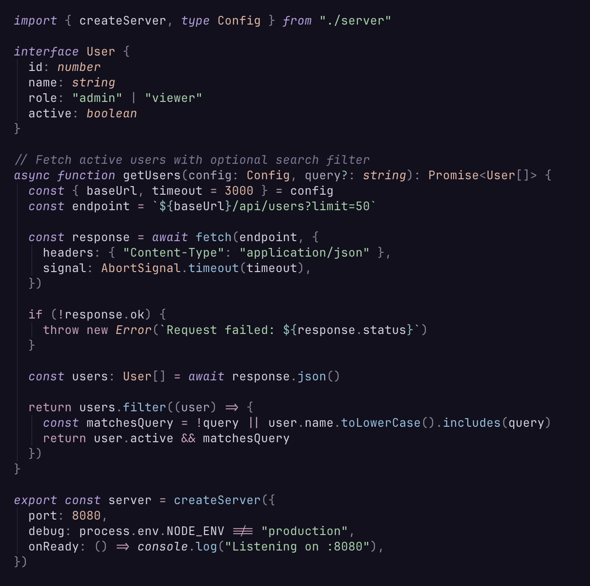

<p align="center">
  
</p>

<h1 align="center">Lume</h1>

<p align="center">
  A muted, elegant dark color theme with warm undertones and a soft lavender identity.<br />
  Built for Neovim, VS Code, terminals, tmux, and CLI tools.
</p>

<p align="center">
  
</p>

## Features

- **Single source of truth** — every color lives in `palette.json`, all outputs are generated
- **WCAG AA contrast** — validated at build time, never ships unreadable text
- **14 Neovim plugin integrations** — Telescope, cmp, gitsigns, mini.nvim, noice, trouble, flash, and more
- **Treesitter + LSP semantic tokens** — full highlighting with 200+ groups
- **11 terminal/CLI targets** — Kitty, Alacritty, WezTerm, Ghostty, iTerm2, foot, Windows Terminal, tmux, fzf, bat, delta, lazygit
- **Transparent mode** — use your terminal's background
- **Configurable italics** — toggle italics for comments and keywords

## Palette

<table>
  <tr>
    <td>
      <br />
      <strong>Lavender</strong><br />
      <code>#b8a0e0</code><br />
      <sub>keywords, primary</sub>
    </td>
    <td>
      <br />
      <strong>Rose</strong><br />
      <code>#d0a0b8</code><br />
      <sub>operators, flow</sub>
    </td>
    <td>
      <br />
      <strong>Peach</strong><br />
      <code>#e8b4a0</code><br />
      <sub>types, constants</sub>
    </td>
    <td>
      <br />
      <strong>Sage</strong><br />
      <code>#a0d4a8</code><br />
      <sub>strings, additions</sub>
    </td>
  </tr>
  <tr>
    <td>
      <br />
      <strong>Sky</strong><br />
      <code>#8cc0e0</code><br />
      <sub>functions, methods</sub>
    </td>
    <td>
      <br />
      <strong>Teal</strong><br />
      <code>#88c0b8</code><br />
      <sub>special, escape</sub>
    </td>
    <td>
      <br />
      <strong>Ember</strong><br />
      <code>#c49080</code><br />
      <sub>errors, deletions</sub>
    </td>
    <td>
      <br />
      <strong>Honey</strong><br />
      <code>#c4b080</code><br />
      <sub>warnings, search</sub>
    </td>
  </tr>
</table>

<details>
<summary>Backgrounds &amp; foregrounds</summary>

| Swatch | Name | Hex | Role |
|--------|------|-----|------|
|  | Crust | `#0a0814` | Deepest background |
|  | Mantle | `#0e0c18` | Status bars, borders |
|  | Base | `#12101e` | Editor background |
|  | Surface 0 | `#1e1a2c` | Floats, selections |
|  | Surface 1 | `#262236` | Active UI elements |
|  | Surface 2 | `#302c42` | Scrollbars, subtle UI |

| Swatch | Name | Hex | Role |
|--------|------|-----|------|
|  | Text | `#d8d0e4` | Primary text |
|  | Subtext | `#b0a8c4` | Secondary text |
|  | Overlay | `#8a8498` | UI elements |
|  | Comment | `#7e7896` | Comments |

</details>

## Installation

### Neovim

#### lazy.nvim

```lua
{
  "danfry1/lume",
  lazy = false,
  priority = 1000,
  opts = {
    transparent = false,
    italics = true,
  },
  config = function(_, opts)
    require("lume").setup(opts)
    vim.cmd("colorscheme lume")
  end,
}
```

<details>
<summary>packer.nvim</summary>

```lua
use {
  "danfry1/lume",
  config = function()
    require("lume").setup({
      transparent = false,
      italics = true,
    })
    vim.cmd("colorscheme lume")
  end,
}
```

</details>

#### Options

| Option | Type | Default | Description |
|--------|------|---------|-------------|
| `transparent` | `boolean` | `false` | Remove background color (use terminal background) |
| `italics` | `boolean` | `true` | Enable italic text for comments and keywords |

#### Plugin support

Highlight groups are included for these plugins (loaded automatically, no config needed):

| Plugin | Plugin | Plugin |
|--------|--------|--------|
| [telescope.nvim](https://github.com/nvim-telescope/telescope.nvim) | [nvim-cmp](https://github.com/hrsh7th/nvim-cmp) | [gitsigns.nvim](https://github.com/lewis6991/gitsigns.nvim) |
| [mini.nvim](https://github.com/echasnovski/mini.nvim) | [noice.nvim](https://github.com/folke/noice.nvim) | [nvim-notify](https://github.com/rcarriga/nvim-notify) |
| [trouble.nvim](https://github.com/folke/trouble.nvim) | [flash.nvim](https://github.com/folke/flash.nvim) | [neo-tree.nvim](https://github.com/nvim-neo-tree/neo-tree.nvim) |
| [oil.nvim](https://github.com/stevearc/oil.nvim) | [lazy.nvim](https://github.com/folke/lazy.nvim) | [which-key.nvim](https://github.com/folke/which-key.nvim) |
| [indent-blankline.nvim](https://github.com/lukas-reineke/indent-blankline.nvim) | [dashboard-nvim](https://github.com/nvimdev/dashboard-nvim) / [alpha-nvim](https://github.com/goolord/alpha-nvim) | |

---

### VS Code

Search for **"Lume"** in the Extensions Marketplace, or install from the command line:

```bash
code --install-extension DanielFry.lume-color-theme
```

<details>
<summary>Install from source</summary>

```bash
cd editors/vscode
npx @vscode/vsce package
code --install-extension lume-0.1.0.vsix
```

</details>

---

### Terminals

> **Prefer not to run curl?** You can also clone the repo and copy the files from `terminals/` manually.

<details>
<summary>Kitty</summary>

```bash
curl -o ~/.config/kitty/lume.conf https://raw.githubusercontent.com/danfry1/lume/main/terminals/kitty/lume.conf
```

Then add to `~/.config/kitty/kitty.conf`:

```
include lume.conf
```

</details>

<details>
<summary>Alacritty</summary>

```bash
curl -o ~/.config/alacritty/lume.toml https://raw.githubusercontent.com/danfry1/lume/main/terminals/alacritty/lume.toml
```

Then add to `~/.config/alacritty/alacritty.toml`:

```toml
import = ["~/.config/alacritty/lume.toml"]
```

</details>

<details>
<summary>WezTerm</summary>

```bash
mkdir -p ~/.config/wezterm/colors
curl -o ~/.config/wezterm/colors/lume.toml https://raw.githubusercontent.com/danfry1/lume/main/terminals/wezterm/lume.toml
```

Then set in `~/.config/wezterm/wezterm.lua`:

```lua
config.color_scheme = "lume"
```

</details>

<details>
<summary>iTerm2</summary>

```bash
curl -o /tmp/lume.itermcolors https://raw.githubusercontent.com/danfry1/lume/main/terminals/iterm2/lume.itermcolors
open /tmp/lume.itermcolors
```

Then go to **iTerm2 → Settings → Profiles → Colors → Color Presets…** and select **Lume**.

</details>

<details>
<summary>Ghostty</summary>

```bash
mkdir -p ~/.config/ghostty/themes
curl -o ~/.config/ghostty/themes/lume https://raw.githubusercontent.com/danfry1/lume/main/terminals/ghostty/lume
```

Then add to `~/.config/ghostty/config`:

```
theme = lume
```

</details>

<details>
<summary>foot</summary>

```bash
curl -o ~/.config/foot/lume.ini https://raw.githubusercontent.com/danfry1/lume/main/terminals/foot/lume.ini
```

Then add to `~/.config/foot/foot.ini`:

```ini
include=~/.config/foot/lume.ini
```

</details>

<details>
<summary>Windows Terminal</summary>

```powershell
curl -o "$env:LOCALAPPDATA\lume.json" https://raw.githubusercontent.com/danfry1/lume/main/terminals/windows-terminal/lume.json
```

Then copy the contents of `lume.json` into the `schemes` array in your Windows Terminal `settings.json`, and set `"colorScheme": "Lume"` on the desired profile.

</details>

---

### Tmux

**Via TPM (recommended)**

```tmux
# ~/.tmux.conf
set -g @plugin 'danfry1/lume'
run '~/.tmux/plugins/tpm/tpm'
```

<details>
<summary>Manual</summary>

```bash
# In ~/.tmux.conf
run-shell /path/to/lume/tmux/lume.tmux
```

</details>

---

### CLI Tools

> **Prefer not to run curl?** You can also clone the repo and copy the files from `cli/` manually.

<details>
<summary>fzf</summary>

```bash
curl -o ~/.config/fzf/lume.sh https://raw.githubusercontent.com/danfry1/lume/main/cli/fzf/lume.sh
```

Then source it in your shell rc:

```bash
# ~/.bashrc or ~/.zshrc
source ~/.config/fzf/lume.sh
```

</details>

<details>
<summary>bat</summary>

```bash
curl -o "$(bat --config-dir)/themes/lume.tmTheme" https://raw.githubusercontent.com/danfry1/lume/main/cli/bat/lume.tmTheme
bat cache --build
```

Then set the theme in `~/.config/bat/config`:

```
--theme="Lume"
```

</details>

<details>
<summary>delta</summary>

```bash
curl -s https://raw.githubusercontent.com/danfry1/lume/main/cli/delta/lume.gitconfig >> ~/.gitconfig
```

Then set delta as your Git pager in `~/.gitconfig`:

```ini
[core]
  pager = delta
```

</details>

<details>
<summary>lazygit</summary>

```bash
mkdir -p ~/.config/lazygit
curl -o ~/.config/lazygit/lume.yml https://raw.githubusercontent.com/danfry1/lume/main/cli/lazygit/lume.yml
```

Then reference it in your lazygit `config.yml`:

```yaml
gui:
  theme:
    activeBorderColor:
      - '#b8a0e0'
      - bold
```

</details>

---

## Contributing

`palette.json` is the single source of truth for all colors. All theme files are generated from it.

```bash
bun install          # install dependencies
bun run generate     # regenerate all outputs from palette.json
bun test             # run tests
bun run validate     # check WCAG AA contrast ratios
bun run check        # verify generated files are up to date
bun run typecheck    # typecheck TypeScript
```

Please run `bun run generate` and commit the results before opening a PR.

## License

[MIT](LICENSE)
